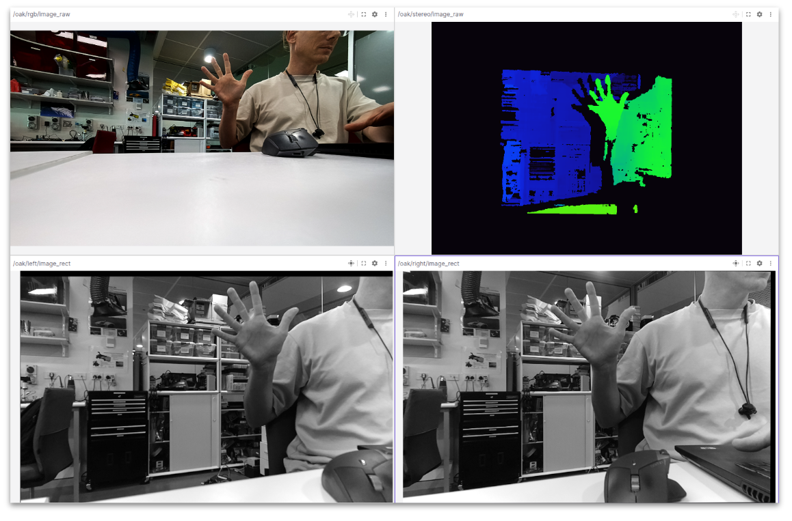

# DepthAI ROS2 Jazzy — OAK-FFC-3P

Fork of [depthai-ros](https://github.com/luxonis/depthai-ros) (`kilted` branch) targeting **ROS2 Jazzy LTS** on the **Luxonis OAK-FFC-3P** camera module:

- **IMX577** color sensor (1920x1080)
- **2x OV9282** global shutter mono sensors (1280x800) — stereo pair
- **BMI270** IMU



Goals: stereo depth with host-side filtering, point cloud generation, Basalt VIO integration, and AI inference (YOLO).

Upstream docs: [docs.luxonis.com/software-v3/depthai/ros](https://docs.luxonis.com/software-v3/depthai/ros/depthai-ros/)

---

## Installation for ROS2 Jazzy (Build from Source)

> **Important:** The official [Build from Source](https://docs.luxonis.com/software-v3/depthai/ros/build/) instructions use `install_dependencies.sh` which installs a **pre-built binary** of depthai-core. As of November 2025, this binary is incompatible with the depthai-ros `kilted` branch on ROS2 Jazzy - it fails with missing `MapData.hpp` errors.
>
> **The fix:** Build depthai-core from source instead of using the pre-built binary.

### Prerequisites

```bash
# ROS2 Jazzy must be installed
source /opt/ros/jazzy/setup.bash

# Install build dependencies
sudo apt update
sudo apt install -y build-essential cmake git python3-colcon-common-extensions \
    python3-rosdep python3-vcstool libusb-1.0-0-dev libopencv-dev
```

### Step 1: Build and Install depthai-core from Source

**Do NOT use `install_dependencies.sh`** - it installs an incompatible pre-built binary.

```bash
# Choose an installation directory
cd ~/  # or your preferred location

# Clone depthai-core with submodules (kilted branch)
git clone --branch kilted --recursive https://github.com/luxonis/depthai-core.git
cd depthai-core

# Install python examples 
python3 -m venv venv
source venv/bin/activate
# Installs library and requirements
python3 examples/python/install_requirements.py
echo "export OPENBLAS_CORETYPE=ARMV8" >> ~/.bashrc && source ~/.bashrc


# Configure with Basalt VIO support (downloads ~80 vcpkg packages - takes time)
cmake -S . -B build \
    -DDEPTHAI_BASALT_SUPPORT=ON \
    -DDEPTHAI_RTABMAP_SUPPORT=OFF \
    -DCMAKE_INSTALL_PREFIX=/usr/local

# Build (use -j1 to prevent crashes on memory-limited systems, or -j4 with enough RAM)
cmake --build build -j1

# Install (requires sudo for /usr/local)
sudo cmake --install build

# Update library cache so the system can find libdepthai-core.so
sudo ldconfig
```

**Note:** The cmake configure step downloads vcpkg dependencies including Basalt. The build takes significant time with `-j1`.

### Step 2: Set Up USB Rules

```bash
echo 'SUBSYSTEM=="usb", ATTRS{idVendor}=="03e7", MODE="0666"' | sudo tee /etc/udev/rules.d/80-movidius.rules
sudo udevadm control --reload-rules && sudo udevadm trigger
```

### Step 3: Create ROS2 Workspace and Clone depthai-ros

```bash
# Create workspace
mkdir -p ~/dai_ws/src
cd ~/dai_ws/src

# Clone depthai-ros (kilted branch for Jazzy)
git clone --branch kilted https://github.com/luxonis/depthai-ros.git
```

### Step 4: Install ROS Dependencies

```bash
cd ~/dai_ws
sudo rosdep init  # Skip if already initialized
rosdep update
rosdep install --from-paths src --ignore-src -r -y
```

### Step 5: Build depthai-ros

```bash
cd ~/dai_ws
source /opt/ros/jazzy/setup.bash

# Build with CMAKE_PREFIX_PATH to find depthai-core in /usr/local
CMAKE_PREFIX_PATH="/usr/local:$CMAKE_PREFIX_PATH" \
MAKEFLAGS="-j1 -l1" \
colcon build --parallel-workers 1
```

### Step 6: Source the Workspace

```bash
source ~/dai_ws/install/setup.bash
```

Add to your `.bashrc` for persistence:

```bash
echo "source ~/dai_ws/install/setup.bash" >> ~/.bashrc
```

### Step 7: Verify Installation

```bash
# Test basic camera launch
ros2 launch depthai_ros_driver driver.launch.py
```

### Troubleshooting Installation

#### Error: `libdepthai-core.so: cannot open shared object file`

```bash
sudo ldconfig
```

#### Error: `MapData.hpp: No such file or directory`

This means you're using the pre-built binary from `install_dependencies.sh`. You need to build depthai-core from source (Step 1).

#### CMake can't find depthai

Ensure CMAKE_PREFIX_PATH includes `/usr/local`:

```bash
export CMAKE_PREFIX_PATH="/usr/local:$CMAKE_PREFIX_PATH"
```

#### Broken cmake config in /opt/ros/jazzy

If you previously ran `install_dependencies.sh` and see errors about `depthai.backup-*` directories:

```bash
sudo rm -rf /opt/ros/jazzy/lib/x86_64-linux-gnu/cmake/depthai.backup-*
```

#### Build crashes (out of memory)

Use single-threaded build:

```bash
MAKEFLAGS="-j1 -l1" colcon build --parallel-workers 1
```

### Build Info

Successfully tested with:

- **depthai-core:** `kilted` branch (commit `d1e4f8139` from 2025-11-26)
- **depthai-ros:** `kilted` branch
- **ROS2:** Jazzy
- **Ubuntu:** 24.04

---

## OAK-FFC-3P Custom Configuration

This fork contains custom configurations for the OAK-FFC-3P with:

- **CAM_A (socket 0)**: IMX577 color camera (1920x1080)
- **CAM_B (socket 1)**: OV9782 mono camera - LEFT (1280x800)
- **CAM_C (socket 2)**: OV9782 mono camera - RIGHT (1280x800)
- **IMU**: BMI270

### Available Configuration Files

| Config File | Pipeline | Use Case |
|-------------|----------|----------|
| `oak_ffc_3p.yaml` | RGBStereo | Basic streaming (RGB + stereo + IMU) |
| `oak_ffc_3p_sync.yaml` | RGBStereo | Hardware-synced 3-camera streaming for camera calibration |
| `oak_ffc_3p_stereo_imu.yaml` | Stereo | **Stereo-only + IMU for IMU calibration** (higher FPS) |
| `oak_ffc_3p_rgbd.yaml` | RGBD | Depth output (use after calibration) |
| `oak_ffc_3p_stereo_disparity.yaml` | RGBD | **Stereo disparity with host-side filters** |

### Key Files

| File | Purpose |
|------|---------|
| `scripts/basalt_to_depthai_calib.py` | Convert basalt calibration to DepthAI format |
| `config/oak_ffc_3p_basalt_calib.json` | Basalt-converted calibration file |
| `config/oak_ffc_3p_depthai_calib.json` | DepthAI-core calibration file |
| `depthai_ros_driver/config/oak_ffc_3p_stereo_disparity.yaml` | ROS config for stereo with calibration |

---

## Calibration Sources

There are two ways to calibrate your OAK camera and two places calibration can be stored:

### Option 1: EEPROM Calibration (Recommended)

Calibration stored on the device EEPROM. This is the **recommended** approach.

**Advantages:**

- Calibration travels with the device
- Includes proper stereo rectification matrices computed by depthai
- Lower reprojection errors (typically <0.5 pixels)
- No external file needed

**How to use:**

1. Run depthai-core calibration (see [DepthAI Calibration](#depthai-core-calibration))
2. Flash to EEPROM using `calibration_flash.py`
3. **Comment out** `i_external_calibration_path` in your config (or remove it)
4. depthai-ros automatically reads from EEPROM

```yaml
driver:
  # Comment out or remove to use EEPROM calibration
  # i_external_calibration_path: '/path/to/calibration.json'
```

### Option 2: External File Calibration

Calibration loaded from a JSON file at runtime. Useful for testing or when you can't flash EEPROM.

**Advantages:**

- Easy to swap between different calibrations
- No EEPROM flashing required
- Can use basalt VIO calibration

**How to use:**

```yaml
driver:
  # Uncomment ONE of these:
  # i_external_calibration_path: '/path/to/oak_ffc_3p_depthai_calib.json'  # depthai-core
  # i_external_calibration_path: '/path/to/oak_ffc_3p_basalt_calib.json'   # basalt VIO
```

### Calibration Comparison

| Feature | DepthAI-Core (EEPROM) | Basalt VIO (External) |
|---------|----------------------|----------------------|
| Storage | Device EEPROM | JSON file |
| Rectification | Proper stereo rectification | Simplified (identity left) |
| Reprojection error | ~0.2-0.5 px | ~0.5-1.0 px |
| IMU-camera extrinsics | Optional | Yes (VIO-optimized) |
| Best for | Stereo depth only | VIO/SLAM applications |

---

## DepthAI-Core Calibration

### Overview

The depthai-core Python library includes calibration tools that:

1. Guide you through capturing calibration images
2. Compute intrinsics, distortion, and extrinsics
3. Calculate proper stereo rectification matrices
4. Flash results to device EEPROM

### Prerequisites

```bash
pip install depthai opencv-python
```

### Calibration Steps

1. **Run the calibration script:**

```bash
cd /media/logic/USamsung/depthai-core/examples/python/Calibration
python3 calibration.py -s 2.5 -brd OAK-FFC-3P
```

- `-s 2.5`: Square size in cm (measure your checkerboard)
- `-brd OAK-FFC-3P`: Board type

1. **Follow the on-screen instructions** to capture images from different angles

2. **Review the results:**

```bash
Reprojection error (should be < 1.0):
  CAM_A: 0.23 px
  CAM_B: 0.31 px
  CAM_C: 0.28 px
```

1. **Flash to EEPROM:**

```bash
python3 calibration_flash.py /path/to/calibration_output.json
```

1. **Verify the calibration:**

```bash
python3 calibration_dump.py
```

### Backup and Restore

The calibration file is saved to `resources/` with a timestamp:

```bash
resources/14442C10B1991CD000_2025-12-12_11-50.json
```

To restore a previous calibration:

```bash
python3 calibration_flash.py resources/14442C10B1991CD000_2025-12-12_11-50.json
```

A backup of the previous EEPROM contents is automatically saved to `depthai_calib_backup.json`.

---

## Basalt Calibration Integration

### Overview

**Problem**: Basalt VIO calibration produces a `calibration.json` file in its own format, which differs from DepthAI's calibration format.

**Solution**: Use the `basalt_to_depthai_calib.py` conversion script to convert between formats.

### Calibration Models

#### Basalt Camera Models

| Model | Parameters | Config Setting |
|-------|------------|----------------|
| `pinhole` | fx, fy, cx, cy | `i_enable_distortion_correction: false` |
| `pinhole-radtan8` | fx, fy, cx, cy, k1-k6, p1, p2 | `i_enable_distortion_correction: true` |

**Recommendation**: Use `pinhole-radtan8` for better accuracy with lens distortion.

#### DepthAI Distortion Format

DepthAI uses 14 distortion coefficients in OpenCV order:

```bash
[k1, k2, p1, p2, k3, k4, k5, k6, s1, s2, s3, s4, τx, τy]
```

The conversion script automatically maps basalt's radtan8 coefficients to this format.

---

## Calibration Workflow

### Prerequisites

- ROS2 Jazzy installed
- Workspace built: `colcon build`
- Basalt VIO installed for calibration

### Step 1: Record Calibration Data

Two separate recordings are needed: one for camera calibration (all 3 cameras) and one for IMU calibration (stereo-only, higher FPS).

#### Recording A: Camera Calibration (3 cameras + IMU)

Use the hardware-synced 3-camera config. Move the **AprilGrid board** in front of a stationary camera, covering all image regions at varying distances and angles.

```bash
# Terminal 1: Start the driver with 3-camera sync config
cd /media/logic/USamsung/dai_ws
source install/setup.bash
ros2 launch depthai_ros_driver driver.launch.py \
  params_file:=$(pwd)/src/depthai-ros/depthai_ros_driver/config/oak_ffc_3p_sync.yaml \
  camera_model:=OAK-FFC-3P
```

```bash
# Terminal 2: Record all 3 cameras + IMU
cd /media/logic/USamsung/oak_calibration
source /opt/ros/jazzy/setup.bash
ros2 bag record -o cam_calibration \
  /oak/left/image_raw \
  /oak/rgb/image_raw \
  /oak/right/image_raw \
  /oak/imu/data
```

**Tips:** 30-60 seconds, slow smooth movements, cover all corners with the AprilGrid, vary distance.

#### Recording B: IMU Calibration (stereo-only + IMU)

Use the stereo-only config — this disables the RGB camera, freeing USB bandwidth so the stereo pair runs at 30 fps instead of ~4.5 fps. Mount the **AprilGrid on a wall** and **move the camera rig** dynamically.

```bash
# Terminal 1: Start the driver with stereo-only config
cd /media/logic/USamsung/dai_ws
source install/setup.bash
ros2 launch depthai_ros_driver driver.launch.py \
  params_file:=$(pwd)/src/depthai-ros/depthai_ros_driver/config/oak_ffc_3p_stereo_imu.yaml \
  camera_model:=OAK-FFC-3P
```

```bash
# Terminal 2: Record stereo + IMU only
cd /media/logic/USamsung/oak_calibration
source /opt/ros/jazzy/setup.bash
ros2 bag record -o imu_calibration \
  /oak/left/image_raw \
  /oak/right/image_raw \
  /oak/imu/data
```

**Tips:** 60-90 seconds, rotate around all 3 axes (pitch, yaw, roll), keep AprilGrid visible in both cameras, hold still 2-3 seconds at start and end.

**Why two recordings?** The 3-camera config (all BGR8) saturates USB bandwidth, limiting camera FPS to ~4.5 fps. IMU calibration needs higher camera rates (15-30 fps) to properly constrain the time alignment and motion model. The stereo-only config drops the RGB camera, allowing the stereo pair to reach 30 fps.

### Step 2: Run Basalt Calibration

See the [Basalt ROS2 README](https://github.com/roboticsmick/basalt_ros2) for detailed calibration steps. The workflow is:

1. **Camera calibration** — run `basalt_calibrate` on Recording A (3 cameras) with `--cam-types pinhole-radtan8 ds pinhole-radtan8`
2. **Stereo camera calibration** — run `basalt_calibrate` on Recording B (stereo-only) with `--cam-types pinhole-radtan8 pinhole-radtan8`
3. **IMU calibration** — run `basalt_calibrate_imu` on Recording B (stereo-only) with the stereo calibration result

### Step 3: Convert Calibration to DepthAI Format

```bash
cd /media/logic/USamsung/dai_ws

python3 scripts/basalt_to_depthai_calib.py \
  /media/logic/USamsung/oak_calibration/oak_results/calibration.json \
  -o config/oak_ffc_3p_basalt_calib.json
```

The script will output:

- Calibration parameters for verification
- Camera intrinsics (fx, fy, cx, cy)
- Distortion coefficients (if radtan8)
- Camera extrinsics (stereo baseline)
- Recommended config settings

**Example output:**

```bash
Basalt calibration info:
  Camera 0: 1280x800 (pinhole-radtan8)
    fx=903.94, fy=905.33
    cx=645.59, cy=386.88
    k1=-7.6401, k2=19.0957, k3=-12.5117
    ...

To use this calibration with depthai-ros, add to your config:
    driver:
      i_external_calibration_path: "config/oak_ffc_3p_basalt_calib.json"

    stereo:
      i_enable_distortion_correction: true
```

### Step 4: Launch with Calibration

```bash
cd /media/logic/USamsung/dai_ws
source install/setup.bash

ros2 launch depthai_ros_driver driver.launch.py \
  params_file:=$(pwd)/src/depthai-ros/depthai_ros_driver/config/oak_ffc_3p_stereo_disparity.yaml \
  camera_model:=OAK-FFC-3P
```

### Step 5: View in Foxglove

Connect Foxglove to your ROS2 system and subscribe to:

| Topic | Description |
|-------|-------------|
| `/oak/stereo/image_raw` | Disparity/depth image |
| `/oak/stereo/camera_info` | Stereo camera info |
| `/oak/left_rect/image_raw` | Rectified left image |
| `/oak/right_rect/image_raw` | Rectified right image |
| `/oak/rgb/image_raw` | RGB image |
| `/oak/imu/data` | IMU data |

---

## Camera Mapping

The conversion script assumes the default OAK-FFC-3P camera order:

| Basalt Index | Resolution | OAK Socket | Camera | Role |
|--------------|------------|------------|--------|------|
| 0 | 1280x800 | CAM_B (1) | OV9782 | Left stereo |
| 1 | 1920x1080 | CAM_A (0) | IMX577 | RGB |
| 2 | 1280x800 | CAM_C (2) | OV9782 | Right stereo |

If your cameras are in a different order, use `--swap-stereo`:

```bash
python3 scripts/basalt_to_depthai_calib.py input.json -o output.json --swap-stereo
```

---

## Hardware Sync Configuration

The `oak_ffc_3p_sync.yaml` configures hardware frame synchronization:

- **Left camera (CAM_B)**: FSYNC OUTPUT (master) - generates sync signal
- **RGB camera (CAM_A)**: FSYNC INPUT (slave) - receives sync signal
- **Right camera (CAM_C)**: FSYNC INPUT (slave) - receives sync signal

This ensures all cameras capture frames at exactly the same timestamp, which is critical for accurate stereo calibration.

### Sync Parameters

| Parameter | Location | Purpose |
|-----------|----------|---------|
| `i_enable_sync` | pipeline_gen | Enable global hardware sync |
| `i_synced` | rgb/stereo | Mark stream for synchronization |

**Note**: depthai-ros uses **one config file** per launch. You don't need separate sync and stereo configs - combine all settings into one file like `oak_ffc_3p_stereo_disparity.yaml`.

---

## Config File Reference

### Stereo Disparity Config (oak_ffc_3p_stereo_disparity.yaml)

```yaml
/oak:
  ros__parameters:
    pipeline_gen:
      i_pipeline_type: RGBD
      i_enable_sync: true
      i_enable_imu: true

    stereo:
      i_output_disparity: true
      i_enable_distortion_correction: true
      i_depth_preset: FAST_ACCURACY     # No device PostProcessing (avoids double-filtering)
      i_use_host_filters: true          # Host-side ImageFilters node

      # Stereo matching (ROBOTICS-based settings)
      i_subpixel: true
      i_subpixel_fractional_bits: 3     # 8x disparity scale
      i_lr_check: true
      i_lrc_threshold: 10
      i_extended_disp: true             # Close-range depth (0.3m+)
      i_stereo_conf_threshold: 15
      i_bilateral_sigma: 0

      # Host-side filters
      i_median_filter: "KERNEL_5x5"
      i_enable_speckle_filter: true
      i_speckle_filter_speckle_range: 200
      i_speckle_filter_difference_threshold: 16   # 2 * 8 (subpixel scaled)
      i_enable_spatial_filter: true
      i_spatial_filter_hole_filling_radius: 2
      i_spatial_filter_alpha: 0.5
      i_spatial_filter_delta: 160                  # 20 * 8 (subpixel scaled)
      i_spatial_filter_iterations: 1
      i_enable_temporal_filter: false
      i_enable_threshold_filter: true
      i_threshold_filter_min_range: 300            # 0.3m
      i_threshold_filter_max_range: 10000          # 10m
```

---

## Depth Filtering & Quality Improvement

The stereo depth output can be noisy with holes (invalid pixels). DepthAI provides multiple filters to produce smooth, dense depth maps suitable for RGB-D applications.

### Host-Side vs Device-Side Filtering

Filters can run in two places:

| Mode | Where | Parameter | Notes |
|------|-------|-----------|-------|
| **Host-side** (recommended) | CPU via `ImageFilters` node | `i_use_host_filters: true` | Matches Python tuning script behavior, full control |
| **Device-side** | VPU via `StereoDepthConfig::PostProcessing` | `i_use_host_filters: false` | Lower CPU usage, but some presets enable conflicting filters |

**Important:** Some depth presets (e.g., `HIGH_DETAIL`) enable device-side PostProcessing filters internally. If you also enable host-side filters, you get **double filtering** which produces poor results. Use `FAST_ACCURACY` preset with host-side filters to avoid this.

```yaml
# Recommended: host-side filtering with a lightweight preset
i_use_host_filters: true
i_depth_preset: FAST_ACCURACY
```

### Filter Pipeline (Host-Side)

```sh
Raw Disparity → Speckle → Temporal → Spatial → Median → Output
```

Filters are applied in order by the `ImageFilters` node on the host CPU.

### Depth Presets

| Preset | Description | Device PostProcessing | Best For |
|--------|-------------|----------------------|----------|
| `FAST_ACCURACY` | Lightweight, no PostProcessing | **None** | Use with host-side filters |
| `DEFAULT` | Balanced quality/performance | Some | General use (device filters only) |
| `HIGH_DETAIL` | Maximum detail, dense output | **Heavy** | Device-only filtering (conflicts with host filters) |
| `HIGH_ACCURACY` | Most accurate depth values | Some | Measurement applications |
| `ROBOTICS` | Conservative, reliable depth | Some | Obstacle avoidance, navigation |
| `FACE` | Optimized for close-range faces | Some | Face tracking |

```yaml
i_depth_preset: FAST_ACCURACY  # Recommended when using host-side filters
```

### Stereo Matching Parameters

| Parameter | Range | Default | Description |
|-----------|-------|---------|-------------|
| `i_subpixel` | bool | true | Enable subpixel accuracy (smoother gradients) |
| `i_subpixel_fractional_bits` | 3-5 | 3 | Subpixel precision bits (higher = more precise) |
| `i_lr_check` | bool | true | Left-right consistency check (removes bad matches) |
| `i_lrc_threshold` | 0-10 | 10 | LR check strictness (lower = stricter, fewer holes) |
| `i_extended_disp` | bool | false | Extended disparity for very close objects (<35cm) |
| `i_disparity_width` | string | DISPARITY_96 | `DISPARITY_64` or `DISPARITY_96` |

```yaml
i_subpixel: true
i_subpixel_fractional_bits: 3    # 8x disparity scale
i_lr_check: true
i_lrc_threshold: 10              # FAST_DENSITY base value
i_extended_disp: true            # Enables close-range depth (0.3m+)
```

### Confidence & Bilateral Filter

| Parameter | Range | Default | Description |
|-----------|-------|---------|-------------|
| `i_stereo_conf_threshold` | 0-255 | 15 | Min confidence to accept pixel (higher = fewer holes but sparser) |
| `i_bilateral_sigma` | 0-250 | 0 | Edge-preserving smoothing (0=off, 250=max smooth) |

```yaml
# With host-side filters (i_use_host_filters: true):
i_stereo_conf_threshold: 15   # Low value to accept more pixels (host filters handle noise)
i_bilateral_sigma: 0          # Disabled (host-side filters handle smoothing)

# Without host-side filters (device-only):
i_stereo_conf_threshold: 200  # Higher value to pre-filter noise on device
i_bilateral_sigma: 250        # Device-side edge-preserving smoothing
```

### Spatial Filter (Hole Filling)

Fills holes by looking at neighboring valid pixels. **Essential for dense depth maps.**

| Parameter | Range | Default | Description |
|-----------|-------|---------|-------------|
| `i_enable_spatial_filter` | bool | false | Enable spatial filtering |
| `i_spatial_filter_hole_filling_radius` | 0-16 | 2 | Radius for hole filling (larger = fills bigger holes) |
| `i_spatial_filter_alpha` | 0.0-1.0 | 0.5 | Filter strength (higher = more smoothing) |
| `i_spatial_filter_delta` | int | 20 | Step size threshold |
| `i_spatial_filter_iterations` | 1-5 | 1 | Number of filter passes |

```yaml
i_enable_spatial_filter: true
i_spatial_filter_hole_filling_radius: 2
i_spatial_filter_alpha: 0.5
i_spatial_filter_delta: 160    # 20 * 8 (scaled for subpixel 3 frac bits)
i_spatial_filter_iterations: 1
```

### Temporal Filter (Frame Averaging)

Uses previous frames to fill holes and reduce flickering. Adds latency. Disabled in the ROBOTICS preset — enable only if you need smoother output and can tolerate the delay.

| Parameter | Range | Default | Description |
|-----------|-------|---------|-------------|
| `i_enable_temporal_filter` | bool | false | Enable temporal filtering |
| `i_temporal_filter_alpha` | 0.0-1.0 | 0.4 | Averaging weight (lower = more smoothing, more latency) |
| `i_temporal_filter_delta` | int | 20 | Temporal consistency threshold (scale for subpixel) |
| `i_temporal_filter_persistency` | string | VALID_2_IN_LAST_4 | How long to persist values |

**Persistency Modes:** `PERSISTENCY_OFF`, `VALID_8_OUT_OF_8`, `VALID_2_IN_LAST_3`, `VALID_2_IN_LAST_4`, `VALID_2_OUT_OF_8`, `VALID_1_IN_LAST_2`, `VALID_1_IN_LAST_5`, `VALID_1_IN_LAST_8`, `PERSISTENCY_INDEFINITELY`

```yaml
# Optional - disabled by default (ROBOTICS preset does not use temporal)
i_enable_temporal_filter: true
i_temporal_filter_alpha: 0.4
i_temporal_filter_delta: 160    # 20 * 8 (scaled for subpixel 3 frac bits)
i_temporal_filter_persistency: "PERSISTENCY_OFF"
```

### Speckle Filter (Noise Removal)

Removes small isolated regions of noise.

| Parameter | Range | Default | Description |
|-----------|-------|---------|-------------|
| `i_enable_speckle_filter` | bool | false | Enable speckle filtering |
| `i_speckle_filter_speckle_range` | 0-255 | 50 | Max disparity difference in connected component |
| `i_speckle_filter_difference_threshold` | 0-255 | 50 | Max diff between neighboring pixels (scale for subpixel) |

```yaml
i_enable_speckle_filter: true
i_speckle_filter_speckle_range: 200
i_speckle_filter_difference_threshold: 16   # 2 * 8 (scaled for subpixel 3 frac bits)
```

### Threshold Filter (Depth Range)

Limits depth output to a specific range. **Important for removing invalid far/near values.**

| Parameter | Range | Default | Description |
|-----------|-------|---------|-------------|
| `i_enable_threshold_filter` | bool | false | Enable threshold filtering |
| `i_threshold_filter_min_range` | int (mm) | 400 | Minimum valid depth (mm) |
| `i_threshold_filter_max_range` | int (mm) | 15000 | Maximum valid depth (mm) |

```yaml
i_enable_threshold_filter: true
i_threshold_filter_min_range: 300    # 0.3m minimum
i_threshold_filter_max_range: 10000  # 10m maximum
```

### Brightness Filter

Filters pixels based on source image brightness.

| Parameter | Range | Default | Description |
|-----------|-------|---------|-------------|
| `i_enable_brightness_filter` | bool | false | Enable brightness filtering |
| `i_brightness_filter_min_brightness` | 0-256 | 0 | Minimum brightness |
| `i_brightness_filter_max_brightness` | 0-256 | 256 | Maximum brightness |

### Decimation Filter (Resolution Reduction)

Reduces output resolution for performance. Uses intelligent downsampling.

| Parameter | Range | Default | Description |
|-----------|-------|---------|-------------|
| `i_enable_decimation_filter` | bool | false | Enable decimation |
| `i_decimation_filter_decimation_factor` | 1-4 | 1 | Downsample factor |
| `i_decimation_filter_decimation_mode` | string | PIXEL_SKIPPING | Downsampling method |

**Decimation Modes:**

| Mode | Description |
|------|-------------|
| `PIXEL_SKIPPING` | Simple pixel skipping (fastest) |
| `NON_ZERO_MEDIAN` | Median of non-zero values (best quality) |
| `NON_ZERO_MEAN` | Mean of non-zero values |

### Median Filter

| Parameter | Values | Default | Description |
|-----------|--------|---------|-------------|
| `i_median_filter` | string | `"MEDIAN_OFF"` | Median filter kernel size |

**Options:** `MEDIAN_OFF`, `KERNEL_3x3`, `KERNEL_5x5`

```yaml
i_median_filter: "KERNEL_5x5"  # Good for removing salt-and-pepper noise
```

### Recommended Settings (ROBOTICS-Based, Navigation)

Tuned for low-noise depth suitable for robotics navigation. Based on the ROBOTICS depth preset values, adapted for host-side filtering. These are the values in `oak_ffc_3p_stereo_disparity.yaml`.

```yaml
stereo:
  i_depth_preset: FAST_ACCURACY        # No device PostProcessing (avoids double-filtering)
  i_use_host_filters: true

  # Stereo matching
  i_subpixel: true
  i_subpixel_fractional_bits: 3        # 8x disparity scale
  i_lr_check: true
  i_lrc_threshold: 10                  # FAST_DENSITY base value
  i_extended_disp: true                # Close-range depth (0.3m+)
  i_stereo_conf_threshold: 15          # Low — let host filters handle noise
  i_bilateral_sigma: 0                 # Disabled — host filters handle smoothing

  # Median filter
  i_median_filter: "KERNEL_5x5"        # ROBOTICS uses 7x7 device-side, 5x5 is host-side max

  # Speckle filter (noise removal)
  i_enable_speckle_filter: true
  i_speckle_filter_speckle_range: 200
  i_speckle_filter_difference_threshold: 16   # 2 * 8 (subpixel scaled)

  # Spatial filter (hole filling)
  i_enable_spatial_filter: true
  i_spatial_filter_hole_filling_radius: 2
  i_spatial_filter_alpha: 0.5
  i_spatial_filter_delta: 160                  # 20 * 8 (subpixel scaled)
  i_spatial_filter_iterations: 1

  # Temporal filter — DISABLED (ROBOTICS preset does not use temporal)
  i_enable_temporal_filter: false

  # Depth range
  i_enable_threshold_filter: true
  i_threshold_filter_min_range: 300    # 0.3m minimum
  i_threshold_filter_max_range: 10000  # 10m maximum
```

### Subpixel Scaling for Filter Parameters

When `i_subpixel: true`, disparity values are scaled by `2^fractional_bits`. Filter delta/threshold parameters must be scaled accordingly:

| Fractional Bits | Scale Factor | Base Delta = 2 | Base Delta = 20 |
| --------------- | ------------ | -------------- | --------------- |
| 3 (default) | 8x | 16 | 160 |
| 4 | 16x | 32 | 320 |
| 5 | 32x | 64 | 640 |

Parameters that need scaling: `i_spatial_filter_delta`, `i_temporal_filter_delta`, `i_speckle_filter_difference_threshold`.

### Filter Tuning Tips

1. **Use host-side filters**: `i_use_host_filters: true` with `i_depth_preset: FAST_ACCURACY` to avoid double-filtering
2. **Keep confidence low**: `i_stereo_conf_threshold: 15` lets more pixels through — host filters handle noise
3. **Disable bilateral**: `i_bilateral_sigma: 0` when using host-side spatial filters
4. **Enable extended disparity**: `i_extended_disp: true` for close-range depth (0.3m+)
5. **Scale for subpixel**: Delta/threshold values must be multiplied by `2^fractional_bits` when subpixel is enabled
6. **Set depth range**: Use threshold filter to remove invalid far/near values
7. **Tune interactively**: Use the Python filter tuning script to find optimal values before setting them in YAML

### Interactive Filter Tuning Script

A Python script (`depthai-core/examples/python/StereoDepth/set_stereo_depth_filters.py`) provides interactive filter tuning with live preview. The DEFAULTS in the script match the ROBOTICS-based settings above.

```bash
cd /path/to/depthai-core/examples/python/StereoDepth
python3 set_stereo_depth_filters.py --display_scale 0.5
```

**Features:**
- Side-by-side raw vs filtered disparity view
- Trackbar controls for all stereo and filter settings
- Runtime toggling of subpixel, LR check, and extended disparity (no restart needed)
- Auto-scaling of filter delta/threshold values when subpixel mode changes
- Color-coded settings panel: yellow = affects both images, cyan = filtered only
- Press 'p' to print current settings to terminal

Once you find good settings, copy the printed values into your ROS YAML config file.

---

## Calibration Parameter Reference

### Basalt pinhole-radtan8 Parameters

```json
{
  "camera_type": "pinhole-radtan8",
  "intrinsics": {
    "fx": 903.94,    // Focal length X (pixels)
    "fy": 905.33,    // Focal length Y (pixels)
    "cx": 645.59,    // Principal point X
    "cy": 386.88,    // Principal point Y
    "k1": -7.64,     // Radial distortion (numerator)
    "k2": 19.10,
    "k3": -12.51,
    "k4": -7.64,     // Radial distortion (denominator)
    "k5": 19.06,
    "k6": -12.45,
    "p1": 0.00068,   // Tangential distortion
    "p2": 0.00112
  }
}
```

### DepthAI Distortion Coefficients

```json
"distortionCoeff": [
  k1, k2,           // Radial (numerator, first two)
  p1, p2,           // Tangential
  k3,               // Radial (numerator, third)
  k4, k5, k6,       // Radial (denominator)
  0, 0, 0, 0, 0, 0  // Thin prism + tilt (unused)
]
```

---

## Troubleshooting

### Disparity looks wrong or inverted

```bash
# Re-run conversion with swapped stereo cameras
python3 scripts/basalt_to_depthai_calib.py input.json -o output.json --swap-stereo
```

### No depth output

- Check that `i_pipeline_type: RGBD` is set
- Verify `i_left_socket_id` and `i_right_socket_id` match your hardware

### Distorted output

- If using radtan8 calibration: ensure `i_enable_distortion_correction: true`
- If using pinhole calibration: set `i_enable_distortion_correction: false`

### Verify calibration loaded

```bash
ros2 param get /oak driver.i_external_calibration_path
```

### Topics listed but no data publishing

- Ensure the driver node is running: `ros2 node list` should show `/oak`
- Check for errors in the launch terminal

### compressedDepth errors

- Normal for RGBStereo pipeline - use `/compressed` not `/compressedDepth`
- compressedDepth only works with depth images (RGBD pipeline)

### "Model name OAK-FFC-3P not found" warning

- Cosmetic only - affects URDF visualization, not camera function

### IMU extrinsics not set warning

- Expected before calibration - will be resolved after applying basalt calibration
